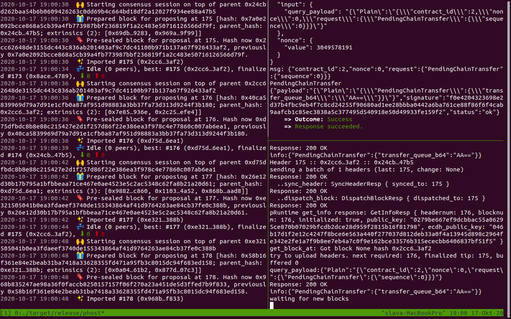
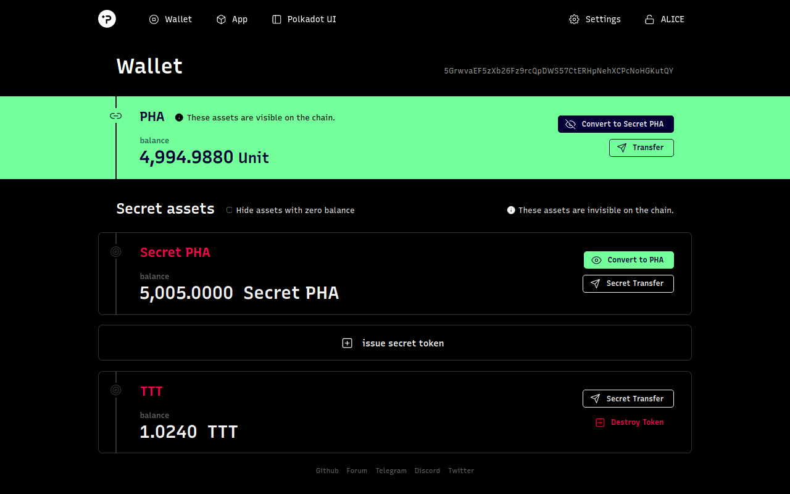

# -ECOSYSTEM-CHALLENGE-Beginner-Build-And-Run-A-Local-Phala-Network

1. Take screenshots of the terminal window with the running core blockchain (phala-node, pruntime, and phost):

                                                                                                                                     
                                                                                                                                                
2. Take a screenshot of your user-issued secret token:

3. Send the screenshot and share your feeling on Twitter:
[Click to see the tweet](https://twitter.com/whisperit3/status/1317518867967676416?s=20/?target=_blank).

